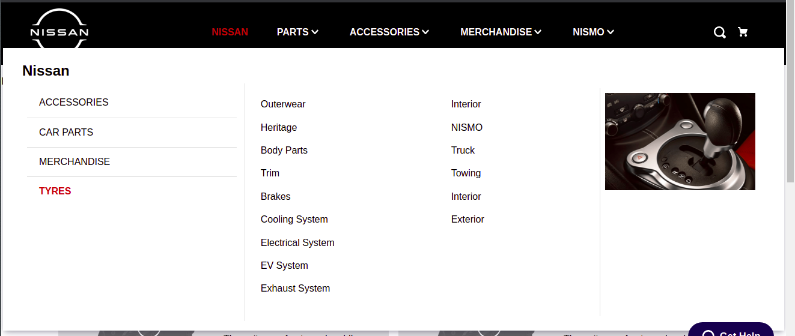

# Side Mega-Menu

The Side Mega-Menu app provides block responsible for displaying menu and submenu of fullwidth layout. Note: This app is only compatible with desktop view. <br>

  Below image shows an example of the **`side-megamenu`** block integrated in store theme header.jsonc file, displaying menu and submenu of fullwidth layout.
  
  
  
  ## Usage

1. Add the `side-megamenu` app to your store theme's dependencies in the manifest.json,<br>

    For example:<br>
    ```json
    "dependencies": {
        "echidna.side-megamenu": "0.x"
    }
    ```

2. Add the `side-megamenu` block to the main-menu-static.jsonc file, delare `"side-mega-menu"` inside the children of `"vtex.menu@2.x:menu#main-menu-static"` block  ,<br>
  
     For example:<br>
     
    ```JSONC
    "vtex.menu@2.x:menu#main-menu-static": {
        "children": [
            ...
            "side-mega-menu#nissan", 
            ...   
        ]
    },
    ```

3. Now define your `"side-mega-menu#nissan"` block. Please find the below code as a sample example:
     
   
<details ><summary>View Full Code</summary>
<p>

```JSON
    "side-mega-menu#nissan": {
        "props": {
            "id": "nissan",
            "imgUrl": "https://echidna.vtexassets.com/arquivos/interior_167.png",
            "itemProps": {
            "href": "/clp/135",
            "tagTitle": "Nissan",
            "text": "Nissan"
            }
        },
        "children": [
            "sub-menu-level-two#Accesories",
            "sub-menu-level-two#CarParts",
            "sub-menu-level-two#Gears",
            "sub-menu-level-two#Tyres"
        ]
        },
        "sub-menu-level-two#Accesories": {
        "props": {
            "title": "Accessories",
            "id": "accessories",
            "content": [
            {"name": "Body Parts", "url": "/car-parts/car-part-accessories"},
            {"name": "Trim", "url": "/car-parts/body-interior-and-trim"},
            {"name": "Brakes", "url": "/car-parts/brakes"},
            {"name": "Cooling System", "url": "/car-parts/cooling-system"},
            {"name": "Electrical System", "url": "/car-parts/brakes"},
            {"name": "EV System", "url": "/car-parts/ev-system"},
            {"name": "Exhaust System", "url": "/car-parts/exhaust-system"}
            ]
        }
        },
        "sub-menu-level-two#CarParts": {
        "props": {
            "title": "Car Parts",
            "id": "car-parts",
            "content": [
            {"name": "Interior", "url": "/car-parts/body-interior-and-trim"},
            {"name": "NISMO", "url": "/accessories/nismo"},
            {"name": "Truck", "url": "/accessories/truck-and-towing"},
            {"name": "Towing", "url": "/accessories/truck-and-towing"},
            {"name": "Interior", "url": "/accessories/interior-accessories"},
            {"name": "Exterior", "url": "/accessories/exterior-accessories"}
            ]
        }
        },
        "sub-menu-level-two#Gears": {
        "props": {
            "title": "Merchandise",
            "id": "merchandise",
            "content": [
            {"name": "Apparel", "url": "/merchandise/apparel"},
            {"name": "Auto Accessories", "url": "/merchandise/auto-accessories"},
            {"name": "Hats", "url": "/merchandise/hats"},
            {"name": "Outerwear", "url": "/merchandise/heritage-collection"},
            {"name": "Heritage", "url": "/merchandise/heritage-collection"}
            ]
        }
        },
        "sub-menu-level-two#Tyres": {
        "props": {
            "title": "Tyres",
            "id": "tyres",
            "content": [
            {"name": "Outerwear", "url": "/merchandise/heritage-collection"},
            {"name": "Heritage", "url": "/merchandise/heritage-collection"},
            {"name": "Body Parts", "url": "/car-parts/car-part-accessories"},
            {"name": "Trim", "url": "/car-parts/body-interior-and-trim"},
            {"name": "Brakes", "url": "/car-parts/brakes"},
            {"name": "Cooling System", "url": "/car-parts/cooling-system"},
            {"name": "Electrical System", "url": "/car-parts/brakes"},
            {"name": "EV System", "url": "/car-parts/ev-system"},
            {"name": "Exhaust System", "url": "/car-parts/exhaust-system"},
            {"name": "Interior", "url": "/car-parts/body-interior-and-trim"},
            {"name": "NISMO", "url": "/accessories/nismo"},
            {"name": "Truck", "url": "/accessories/truck-and-towing"},
            {"name": "Towing", "url": "/accessories/truck-and-towing"},
            {"name": "Interior", "url": "/accessories/interior-accessories"},
            {"name": "Exterior", "url": "/accessories/exterior-accessories"}
            ]
        }
    }
```

</p>
</details> 

4. This will add one menu at the header to get more menu option like this, repeat step 2 and 3.


## Children Block:
```JSON
"sub-menu-level-two"
```
 ###  main-menu-item props:
  
| Prop name | Type | Description                                                                                                                                         | Default Value |
| --------- | -------- | ------------------------------------------------------------------------------------------------------------------------------------------------------- | ----------------- |
| `id`  | `string` |  Menu Id.           | `undefined or ""`|              |
| `imgUrl`  | `string` | Url of the image that is going to be displayed on right side of menu.| `undefined or ""`
| `itemProps`  | `object` |  A set of sub-props for main menu option (like: href, tagTitle, text).| `undefined`|

#### itemProps props:

| Prop name | Type | Description                                                                                                                                         | Default Value |
| --------- | -------- | ------------------------------------------------------------------------------------------------------------------------------------------------------- | ----------------- |
| `href`  | `string` | Onclick CTA for maine menu.           | `undefined or ""`              |
| `tagTitle`  | `string` | Provides the tag title for your menu | `undefined or ""`|
| `text`  | `string` |  Label of the menu | `undefined`|

#### sub-menu-level-two props:

| Prop name | Type | Description                                                                                                                                         | Default Value |
| --------- | -------- | ------------------------------------------------------------------------------------------------------------------------------------------------------- | ----------------- |
| `title`  | `string` |  Title of the submenu level 2 to be displayed.           | `undefined or ""`              |
| `id`  | `string` |  Id of the submenu Level 2.| `undefined or ""`|
| `content` | `array of objects` |  This will contain array of object which provides submenu Level 3 categories and there url. Its basically has an array of 'name' and 'url' objects | `undefined` |

### content sample code
```JSON
    "content": [
        {"name": "Body Parts", "url": "/car-parts/car-part-accessories"},
        {"name": "Trim", "url": "/car-parts/body-interior-and-trim"},
        {"name": "Brakes", "url": "/car-parts/brakes"},
        {"name": "Cooling System", "url": "/car-parts/cooling-system"},
        {"name": "Electrical System", "url": "/car-parts/brakes"},
        {"name": "EV System", "url": "/car-parts/ev-system"},
        {"name": "Exhaust System", "url": "/car-parts/exhaust-system"}
      ]
```

## Customization

Use the below mentioned CSS handles to customize the app according to your store's scenario, for further information on customization using CSS handles, follow the instructions given in the recipe on [Using CSS Handles for store customization](https://vtex.io/docs/recipes/style/using-css-handles-for-store-customization).

| CSS Handles |
| ----------- |
| `megamenuContentWrapper` |
| `menuHeading` |
| `subMenuWrapper` |
| `menuList` |
| `categoryLink` |
| `menuImageWrapper` |
| `menuImage` |
| `megamenuContainer` |
| `menuItemWrapper` |
| `menuTitleWrapper` |
| `mainMenuTitle` |


## Contributors ✨

<!-- ALL-CONTRIBUTORS-LIST:START - Do not remove or modify this section -->
<!-- prettier-ignore-start -->
<!-- markdownlint-disable -->
<table>
  <tr>
    <td><a href="https://github.com/anubhav-parihar-work"><br /><sub><b>Anubhav Parihar</b></sub></a><br /></td>    
  </tr>
</table>

<!-- markdownlint-enable -->
<!-- prettier-ignore-end -->
<!-- ALL-CONTRIBUTORS-LIST:END -->


